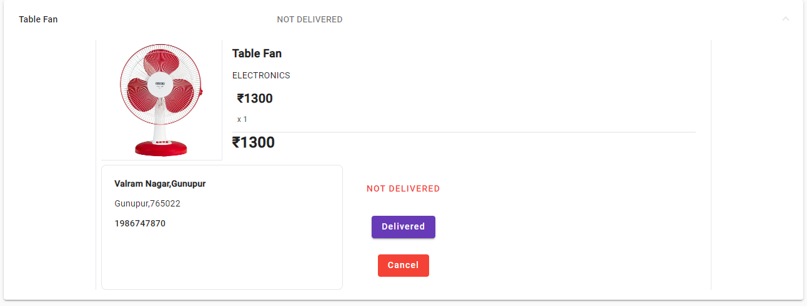
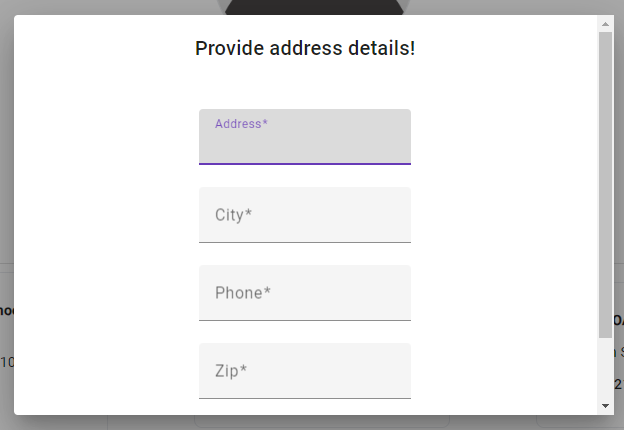
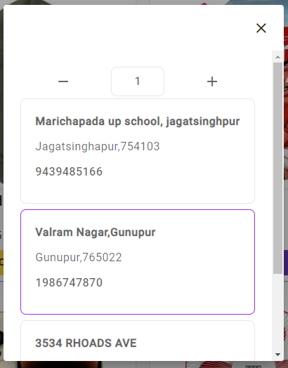

# e-commerce-frontend

Client application for `e-commerce-backend`

> Developer Docs [here](./DeveloperDoc.md)

> All the UI screenshots maintained [here](./ui)

## Components

* ##### Navbar
  
* ##### Product Card
  
* ##### Cart Card
  
* ##### Order Card
  
* ##### Modals
  * ###### Add Address
  
  * ######
  

## Pages

* ##### Home
  
  
* ##### Carts
  
* ##### Orders
  
  
* ##### Profile
  
